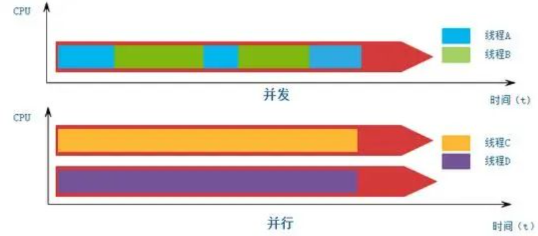
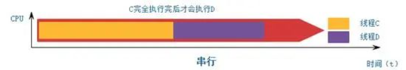

Python并发编程
=============
#### 并发与并行
- 在解释并发与并行之前，我们必须先明确：单个处理器（一个单核CPU）在某一个时刻只能处理一个线程。
- 并发是指在同一个处理器上通过时间片轮转的方式在多个线程之间频繁切换，由于切换速度极快，所以看似多个线程似乎被同时执行，但实际上每一个时刻都只有一个线程被执行，其他的线程出于阻塞状态。
- 并行是指多个处理器在同一时刻同时处理了多个不同的线程，这才是真正意义的同时被执行。
- 如下图所示，线程A与线程B同在一个CPU内执行，且任一t时刻内，都只有一个线程（A或者B）被执行，所以线程A与线程B是并发执行的。线程C和线程D分别在两个CPU内执行，且在某一个t时刻内同时都在执行，所以线程C和线程D是并行的。
- 

#### 并行与串行
- 并行是指多个任务同时执行，而串行是指多个任务时，各个任务按顺序执行，完成一个之后才能进行下一个。
- 所以，并发与并行是在某一时刻是否都在执行的区别。并行与串行是同时进行或一个结束才进行下一个的区别。
- 

#### 同步与异步
- 同步与异步的概念与消息的通知机制有关：
- 同步是指线程在访问某一资源时，获得了资源的返回结果之后才会执行其他操作，否则主动继续获取这一资源；
- 异步与同步相对，是指线程在访问某一资源时，无论是否取得返回结果，都进行下一步操作；当有了资源返回结果时，系统自会通知线程。
- 用一个比喻来说明：10多前的银行是没有业务取号的，我们去办理业务时，如果有很多人，那就先排队，然后关注着什么时候轮到自己，这就是同步；现在去银行，得先取一张小纸条，上面写着你的业务号，轮到你的时候，银行会喊你，这就是异步。异步机制往往注册一个回调机制,在所等待的事件被触发时由触发机制(银行柜台业务员)通过某种机制(业务办理号码)找到等待该事件的人。

#### 阻塞与非阻塞
- 阻塞是与非阻塞都是程序的一种运行状态。
- 线程在等待某个操作完成期间，自身无法继续执行别的操作，则称该线程在该操作上是 阻塞的。
- 线程在等待某个操作完成期间，自身可执行别的操作，则称该线程在该操作上是非阻塞的。
- 继续上面银行办理业务的例子，无论是10多年前的排队办理业务，还是现在的业务号办理业务，如果在我们在等待过程中，什么也不能做，那就是阻塞的；如果在等待过程中，可以做其他事情（看书、玩手游），那就是非阻塞的。
- 同步和异步是个线程处理方式或手段，阻塞和非阻塞是线程的一种状态，两者并不相同也并不冲突。
- 同步、异步与阻塞非阻塞可以产生不同的组合：同步阻塞、同步非阻塞、异步阻塞、异步非阻塞。
- 还是银行办理业务的例子：如果排着队，且只能傻傻的排着队，看着什么时候到自己，那就是同步阻塞；如果排着队还能玩玩手机，偶尔抬头看看什么时候到自己，那就是同步非阻塞。如果是现在的取票按业务号办理业务，拿到号码后就陷入懵逼状态，啥也不能做，直到银行根据业务号通知自己，那就是异步阻塞；如果拿到业务号之后，自己爱干嘛干嘛，那就是异步非阻塞。

#### 进程、线程、协程
1. 基本概念
	- 进程是具有一定独立功能的程序关于某个数据集合上的一次运行活动,进程是系统进行资源分配和调度的一个独立单位，是资源（内存）分配的最小单位。每个进程都有自己的独立内存空间，不同进程通过进程间通信来通信。
	- 由于进程比较重量，占据独立的内存，所以上下文进程间的切换开销（栈、寄存器、虚拟内存、文件句柄等）比较大，但相对比较稳定安全。
	- 线程是进程的一个实体,是CPU调度和分派的基本单位,它是比进程更小的能独立运行的基本单位.线程自己基本上不拥有系统资源,只拥有一点在运行中必不可少的资源(如程序计数器,一组寄存器和栈),但是它可与同属一个进程的其他的线程共享进程所拥有的全部资源。
	- 线程间通信主要通过共享内存，上下文切换很快，资源开销较少，但相比进程不够稳定容易丢失数据。
	- 协程是一种用户态的轻量级线程，协程的调度完全由用户控制。协程拥有自己的寄存器上下文和栈。
	- 协程调度切换时，将寄存器上下文和栈保存到其他地方，在切回来的时候，恢复先前保存的寄存器上下文和栈，直接操作栈则基本没有内核切换的开销，可以不加锁的访问全局变量，所以上下文的切换非常快。

1. 进程与线程
	- 线程是指进程内的一个执行单元,也是进程内的可调度实体。线程与进程的区别:
		- 地址空间:线程是进程内的一个执行单元，进程内至少有一个线程，它们共享进程的地址空间，而进程有自己独立的地址空间；
		- 资源拥有:进程是资源分配和拥有的单位,同一个进程内的线程共享进程的资源；
		- 线程是处理器调度的基本单位,但进程不是；
		- 二者均可并发执行
		- 每个独立的线程有一个程序运行的入口、顺序执行序列和程序的出口，但是线程不能够独立执行，必须依存在应用程序中，由应用程序提供多个线程执行控制。

1. 协程多与线程进行比较
	- 一个线程可以多个协程，一个进程也可以单独拥有多个协程，这样python中则能使用多核CPU。
	- 线程进程都是同步机制，而协程则是异步
	- 协程能保留上一次调用时的状态，每次过程重入时，就相当于进入上一次调用的状态。
