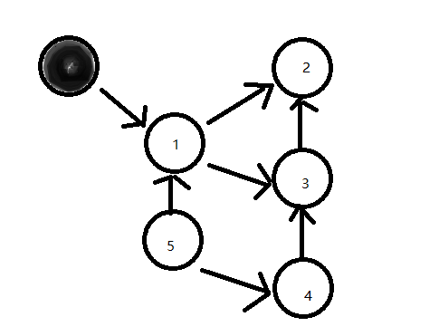

深入理解python特性
============================================
#### assert断言
1. 不要使用断言验证数据，因为命令行中使用-O 和-OO标识，或修改CPython中的PYTHONOPTIMIZE环境变量，都会全局禁用断言
	```
	#temp_test.py
	assert 1 == 2, '断言失败'
	```
	```
	>python36 temp_test.py
	>python36 -O temp_test.py
	```
1. 永不失败的断言
	```
	assert(1 == 2, 'This should fail')
	这是因为在Python中非空元组总为真值
	```
1. 注意事项
	- Python断言语句是一种测试某个条件的调试辅助功能，可作为程序的内部自检。 
	- 断言应该只用于帮助开发人员识别bug，它不是用于处理运行时错误的机制。 
	- 设置解释器可全局禁用断言
#### 巧妙地放置逗号
1. 字符串字面值拼接
	```
	name = [
		'lily',
		'tom'
		'tim'
	]
	print(name)
	```
	```
	tmp_str = (
		'abc'
		'def'
		)
	print(tmp_str)
	```
#### 上下文管理器和with语句
1. 简化一些通用资源管理模式，抽象出其中的功能，将其分解并重用
	```
	with open('hello.txt', 'w') as f: 
		f.write('hello, world!')
	```
	```
	threading.Lock类是Python标准库中另一个比较好的示例
	some_lock = threading.Lock() 
	
	# 有问题: 
	some_lock.acquire() 
	try:
		# 执行某些操作…… 
	finally: 
		some_lock.release() 
		
	# 改进版: 
	with some_lock: 
		#执行某些操作
	```
1. 在自定义对象中支持with
	- 只要实现所谓的上下文管理器 （context manager），就可以在自定义的类和函数中获得相同的功能
	- 上下文管理器是什么？这是一个简单的“协议”（或接口），自定义对象 需要遵循这个接口来支持with语句。总的来说，如果想将一个对象作为 上下文管理器，需要做的就是向其中添加__enter__和__exit__方 法
	- 基于类的上下文管理器
	```
	class ManagerFile:
    def __init__(self, name):
        self.name = name

    def __enter__(self):
        self.file = open(self.name, 'w')
        return self.file

    def __exit__(self, exc_type, exc_val, exc_tb):
        if self.file:
            self.file.close()

	with ManagerFile('hello.txt') as f:
		f.write('hello word')
	```
	- 基于生成器的上下文管理器
	```
	from contextlib import contextmanager

	@contextmanager
	def manage_file(name):
		try:
			f = open(name, 'w')
			yield f
		finally:
			f.close()

	with manage_file('hello.txt') as f:
		f.write('hello word')
	```
#### 下划线、双下划线及其他
1. 前置单下划线：_var 
	- 前置单下划线只有约定含义，前置下划线的意思是提示其他程序员，以单下划线开头的变量或方法只在内部使用
	- 如果使用通配符导入从这个模块中导入所有名称，Python不会导 入带有前置单下划线的名称（除非模块中定义了__all__列表覆盖了这 个行为）
	```
	# my_module.py： 
	def external_func(): 
		return 23 
	def _internal_func(): 
		return 42
	 from my_module import * 
	 external_func() 23
	 _internal_func() NameError: "name '_internal_func' is not defined"
	```
	- 应避免使用通配符导入，因为这样就不清楚当前名称空间 中存在哪些名称了。为了清楚起见，最好坚持使用常规导入方法。与通配符导入不同，常规导入不受前置单下划线命名约定的影响
	```
	import my_module
	my_module.external_func() 23
	my_module._internal_func() 42
	```
2. 后置单下划线：var_ 
	- 某个变量最合适的名称已被Python语言中的关键字占用。因此，诸如class或def的名称不能用作Python中的变量名。在这种情况下，可以追加一个下划线来绕过命名冲突
3. 前置双下划线：__var 
	- 双下划线前缀会让Python解释器重写属性名称，以避免子类中的命名冲突
	```
	class TestClass:
		def __init__(self):
			self.__name = 'QQ'


	class ExtendTestClass(TestClass):
		def __init__(self):
			super(ExtendTestClass, self).__init__()
			self.__name = 'qq'


	tc = TestClass()
	print(dir(tc))

	etc = ExtendTestClass()
	print(dir(etc))
	print(etc.__name)
	名称改写也适用于方法名
	```
	```
	一个神奇的示例
	_ManageGlobal__val = 25

	class ManageGlobal:
		def test(self):
			return __val

	print(ManageGlobal().test())
	```
4. 前后双下划线：__var__ 
	- 双下划线方法通常被称为魔法方法
	- 双下划线方法是Python的核心功能，应根据需要使 用，其中并没有什么神奇或晦涩的内容
5. 单下划线：_
	- 表示变量是临时的或无关紧要的
	```
	我将元组解包为单独的变量，但其中只关注color字段的值。可是为了执行解包表达式就必须为元组中的所有值都分配变量，此时_用作占位符变量
	car = ('red', 'auto', 12, 3812.4)
	color, _, _, _ = car
	print(color)
	```
	- _在大多数Python REPL中是一个特殊变量，表 示由解释器计算的上一个表达式的结果
	```
	20 + 3 
	23
	_ 
	23
	print(_) 
	23
	```
#### 字符串格式化
1. “旧式”字符串格式化
	```
	 'Hello, %s' % name
	 ```
	 ```
	  'Hey %s, there is a % error!' % (name, errno)
	```
1. “新式”字符串格式化
	```
	 'Hello, {}'.format(name)
	```
	```
	'Hey {name}, there is a 0x{errno:x} error!'.format(name=name, errno=errno)
	```
1. 字符串字面值插值
	```
	f'Hello, {name}!'
	```
1. 模板字符串
	```
	from string import Template

	t = Template('this is a ua: $content')
	print(t.substitute(content='{Mozilla/5.0 (Windows NT 10.0; Win64; x64) AppleWebKit/537.36 (KHTML, like Gecko) Chrome/100.0.4896.127 Safari/537.36 Edg/100.0.1185.50}'))
	```
	- 最佳使用场景是用来处理程序用户生成的格式字符串，避免特殊输入出现安全问题
#### 函数
1. 函数是对象
	- 指向函数的变量和函数本身彼此独立
	```
	def func():
		print('call')

	f = func
	del func
	f()
	```
1. 函数可存储在数据结构中
	```
	list = [func,'test']
	```
1. 函数可传递给其他函数
	- 能接受其他函数作为参数的函数被称为高阶函数
	- Python中具有代表性的高阶函数是内置的map函数。map接受一个函数对 象和一个可迭代对象，然后在可迭代对象中的每个元素上调用该函数来生成结果
	```
	def func(num):
		return num * num

	print(list(map(func, [1, 2, 3])))
	```
1. 函数可以嵌套
	```
	def outer(text):
		def inner(input_value):
			return input_value.lower()
		return inner(text)

	print(outer('HELLO'))
	```
1. 函数可捕捉局部状态
	```
	def get_speak_func(text, volume):
		def whisper():
			return text.lower() + '...'

		def yell():
			return text.upper() + '!'

		if volume > 0.5:
			return yell
		else:
			return whisper
	仔细看看内部函数whisper和yell，注意其中并没有text参数。但不 知何故，内部函数仍然可以访问在父函数中定义的text参数。它们似乎 捕捉并“记住”了这个参数的值
	拥有这种行为的函数被称为词法闭包（lexical closure），简称闭包
	```
1. lambda表达式
	```
	add = lambda x, y: x + y
	print(add(1, 2))
	```
	```
	print((lambda x, y: x + y)(3, 4))
	```
	- 因此，lambda能方便灵活地快速定义Python函数。我一般在对可迭代对 象进行排序时，使用lambda表达式定义简短的key函数
	```
	tuples = [(1, 'd'), (2, 'b'), (4, 'a'), (3, 'c')]
	print(sorted(tuples, key=lambda x: x[0]))
	```
	```
	print(sorted(range(-5, 6), key=lambda x: x * x))
	```
	- 前面展示的两个示例在Python内部都有更简洁的实现，分别 是operator.itemgetter()和abs()函数
	- 如果想使用lambda表达式，那么请花几秒（或几分钟）思考，为了获得你所期望的结果，这种方式是否真的最简洁且最易维护
	- 将lambda和map()或filter()结合起来构建复杂的表达式也很难让人理解
	```
	# 有害： 
	list(filter(lambda x: x % 2 == 0, range(16))) 
	[0, 2, 4, 6, 8, 10, 12, 14] 
	# 清晰： 
	[x for x in range(16) if x % 2 == 0] 
	[0, 2, 4, 6, 8, 10, 12, 14]
	```
1. 装饰器
	- 对于理解装饰器来说，“头 等函数”中最重要的特性有： 
		- 函数是对象，可以分配给变量并传递给其他函数，以及从其他函数返回； 
		- 在函数内部也能定义函数，且子函数可以捕获父函数的局部状态（词法闭包）。
	- 最简单的装饰器
	```
	def null_decorator(func): 
		return func
	```
	- 使用Python的@语法能够更方便地修饰函数
	```
	@null_decorator 
	def greet(): 
		return 'Hello!'
	```
	- 装饰器可以修改行为
	```
	def uppercase(func): 
		def wrapper(): 
			original_result = func() 
			modified_result = original_result.upper() 
			return modified_result 
		return wrapper
	```
	- 将多个装饰器应用于一个函数
	```
	def strong(func): 
		def wrapper(): 
			return '<strong>' + func() + '</strong>' 
		return wrapper 
		
	def emphasis(func): 
		def wrapper(): 
			return '<em>' + func() + '</em>' 
		return wrapper
	
	@strong 
	@emphasis 
	def greet(): 
		return 'Hello!'
		
	'<strong><em>Hello!</em></strong>'
	从结果中能清楚地看出装饰器应用的顺序是从下向上
	```
	- 装饰接受参数的函数
	```
	def proxy(func): 
		def wrapper(*args, **kwargs): 
			return func(*args, **kwargs) 
		return wrapper
	```
	- 编写“可调试”的装饰器	
	- 在使用装饰器时，实际上是使用一个函数替换另一个函数。这个过程的 一个缺点是“隐藏”了（未装饰）原函数所附带的一些元数据，如包装闭包隐藏了原函数的名称、文档字符串和参数列表
	- 这增加了调试程序和使用Python解释器的难度。有一个方法能避免这个问题：使用Python标准库中的functools.wraps装饰器
	- 在自己的装饰器中使用functools.wraps能够将丢失的元数据从被装饰的函数复制到装饰器闭包中
	```
	import functools 
	def uppercase(func): 
		@functools.wraps(func) 
		def wrapper(): 
			return func().upper() 
		return wrapper
	```
	- 将functools.wraps应用到由装饰器返回的封装闭包中，会获得原函数的文档字符串和其他元数据
	- 建议最好在自己编写的所有装饰器中都使用functools.wraps！！！
1. 有趣的*args和**kwargs
	```
	def foo(required, *args, **kwargs): 
		print(required) 
		if args: 
			print(args) 
		if kwargs: 
			print(kwargs)
	```
	- 上述函数至少需要一个名为required的参数，但也可以接受额外的位置参数和关键字参数。 
	- 如果用额外的参数调用该函数，args将收集额外的位置参数组成元组， 因为这个参数名称带有*前缀。 
	- 同样，kwargs会收集额外的关键字参数来组成字典，因为参数名称带 有**前缀。 
	- 如果不传递额外的参数，那么args和kwargs都为空
	- 参数args和kwargs只是一个命名约定。哪怕将 其命名为*parms和**argv，前面的例子也能正常工作。
	- 实际起作用的 语法分别是星号（*）和双星号（**），即解包操作符
1. 函数参数解包
	- *和**操作符有一个非常棒但有点神秘的功能，那就是用来从序列和字 典中“解包”函数参数
	```
	tmp_tuple = (1, 2, 3)
	print(*tmp_tuple)
	```
	```
	# tmp_tuple = [x for x in range(3)]
	# 这种技术适用于任何可迭代对象，包括生成器表达式
	tmp_tuple = (x for x in range(3))

	def func(a, b, c):
		print(a * a, b * b, c * c)

	func(*tmp_tuple)
	```
	```
	def func(a, b, c):
		print(a * a, b * b, c * c)
	从字典中解包关键字参数的**操作符
	由于字典是无序的，8因此解包时会匹配字典键和函数参数：x参数接受 字典中与'x'键相关联的值
	tmp_dict = {'a': 1, 'b': 2, 'c': 3}
	func(**tmp_dict)
	```
	```
	如果使用单个星号（*）操作符来解包字典，则所有的键将以随机顺序 传递给函数
	def func(a, b, c):
		print(a, b, c)

	tmp_dict = {'x': 1, 'y': 2, 'z': 3}
	func(*tmp_dict)
	```
1. 返回空值
	- Python在所有函数的末尾添加了隐式的return None语句。因此，如果 函数没有指定返回值，默认情况下会返回None
	```
	def foo1(value): 
		if value: 
			return value 
		else:
			return None 
	def foo2(value): 
	"""纯return语句，相当于`return None`""" 
		if value: 
			return value 
		else:
			return 
	def foo3(value): 
	"""无return语句，也相当于`return None`""" 
		if value: 
			return value
	```
#### 类与面向对象
1. 对象比较：is与==
	- ==操作符比较的是相等性
	- 而is操作符比较的是相同性
	- 当两个变量指向同一个对象时，is表达式的结果为True； 当各变量指向的对象含有相同内容时，==表达式的结果为True
1. 字符串转换（每个类都需要__repr__）
	- 在Python中定义一个自定义类之后，如果尝试在控制台中输出其实例或 在解释器会话中查看，并不能得到十分令人满意的结果
	- 是向类中添加双下划线方法 __str__和__repr__。这两个方法以具有Python特色的方式在不同情况下将对象转换为字符串
	```

	class Car:
		def __init__(self, color, mileage):
			self.color = color
			self.mileage = mileage

		def __str__(self):
			return f'a {self.color} car'


	if __name__ == '__main__':
		c = Car('red', 8888)
		print(c)
	```
	- _str__和__repr它们各自在实际使用中的差异
	```
	import datetime

	today = datetime.date.today()
	print(today)
	print(str(today)) # 2022-04-30
	print(repr(today)) # datetime.date(2022, 4, 30)
	__str__函数的结果侧重于可读性，旨在为人们返回一 个简洁的文本表示
	__repr__侧重的则是得到无歧义的结果，生成的字符串更多的是帮助 开发人员调试程序
	```
	- 为什么每个类都需要__repr__
	- 如果不提供__str__方法，Python在查找__str__时会回退到__repr__ 的结果。因此建议总是为自定义类添加__repr__方法
	```
	class Car:
		def __init__(self, color, mileage):
			self.color = color
			self.mileage = mileage

		def __repr__(self):
			return f'{self.__class__.__name__}({self.color!r},{self.mileage!r})'

	if __name__ == '__main__':
		c = Car('red', 8888)
		print(c)
	```
1. 定义自己的异常类
	- 可以清楚地显示出潜在的错误，让函 数和模块更具可维护性。自定义错误类型还可用来提供额外的调试信息
	```
	class NameTooShortError(ValueError): 
		pass 
	def validate(name): 
		if len(name) < 10: 
			raise NameTooShortError(name)
	```
	- NameTooShortError异常类型，它扩展自内置的ValueError类。一般情况下自定义异常都是派生自Exception这个异常基类或其他内置的Python异常，如ValueError或TypeError，取决于哪个更合适
1. 克隆对象
	- Python中的赋值语句不会创建对象的副本，而只是将名称绑定到对象上。对于不可变对象也是如此。 
	- 但为了处理可变对象或可变对象集合，需要一种方法来创建这些对象 的“真实副本”或“克隆体”。 
	- 从本质上讲，你有时需要用到对象的副本，以便修改副本时不会改动本体
	- Python的内置可变容 器，如列表、字典和集合，调用对应的工厂函数就能完成复制
	- new_list = list(original_list) 
	- new_dict = dict(original_dict) 
	- new_set = set(original_set)
	```
	tmp_list = [1]
	copy_list = list(tmp_list)
	print(tmp_list == copy_list)
	print(tmp_list is copy_list)
	```
	- 但用这种方法无法复制自定义对象，且最重要的是这种方法只创建浅副本
	- 浅复制是指构建一个新的容器对象，然后填充原对象中子对象的引用。 本质上浅复制只执行一层，复制过程不会递归，因此不会创建子对象的副本。 
	- 深复制是递归复制，首先构造一个新的容器对象，然后递归地填充原始 对象中子对象的副本。这种方式会遍历整个对象树，以此来创建原对象 及其所有子项的完全独立的副本
	- 使用copy模块中定义的deepcopy()函 数创建深副本
	```
	import copy

	tmp_list = [[1, 2]]
	copy_list = copy.deepcopy(tmp_list)
	copy_list[0][0] = 2
	print(copy_list)
	print(tmp_list)
	```
	- 顺便说一句，还可以使用copy模块中的一个函数来创建浅副本。copy.copy()函数会创建对象的浅副本
1. 用抽象基类避免继承错误
	- 抽象基类（abstract base class，ABC）用来确保派生类实现了基类中的 特定方法
	```
	from abc import ABCMeta, abstractmethod

	class Base(metaclass=ABCMeta):
		@abstractmethod
		def foo(self):
			pass

		@abstractmethod
		def bar(self):
			pass

	class Concrete(Base):
		def foo(self):
			pass

	assert issubclass(Concrete, Base)
	c = Concrete()
	print(c)
	```
	- 不用abc模块的话，如果缺失某个方法，则只有在实际调用这个方法时 才会抛出NotImplementedError
1. namedtuple的优点
	- 简单元组有一个缺点，那就是存储在其中的数据只能通过整数索引来访 问。无法给存储在元组中的单个属性赋予名称，因而代码的可读性不 高。
	- 元组是一种具有单例性质的数据结构，很难保证两个元组存有相 同数量的字段和相同的属性，因此很容易因为不同元组之间的字段顺序 不同而引入难以意识到的bug
	- namedtuple就是具有名称的元组。存储在其中的每个对象都可以 通过唯一的（人类可读的）标识符来访问。因此不必记住整数索引，也 无须采用其他变通方法，如将整数常量定义为索引的助记符
	```
	from collections import namedtuple

	car = namedtuple('Car', 'color,mileage')
	my_car = car('red', 56798)
	```
	- 将字符串'Car'作为第一个参数传递给 namedtuple工厂函数。 这个参数在Python文档中被称为typename，在调用namedtuple函数时 作为新创建的类名称
	- 由于namedtuple并不知道创建的类最后会赋给哪个变量，因此需要明 确告诉它需要使用的类名
	- namedtuple会自动生成文档字符串和 __repr__，其中的实现中会用到类名
	- 将字段作为'color mileage'这样的字符串整体传递？ 答案是namedtuple的工厂函数会对字段名称字符串调用split()，将其解析为字段名称列表
	```
	'color mileage'.split() 
	['color', 'mileage'] 
	Car = namedtuple('Car', ['color', 'mileage'])
	```
	- 除了通过标识符来访问存储在namedtuple中的值之外，索引访问仍然可用
	```
	print(my_car.color)
	print(my_car[1])
	```
	- 元组解包和用于函数参数解包的*操作符也能正常工作
	```
	color, mileage = my_car
	print(color, mileage)
	print(*my_car)
	```
	- 子类化namedtuple
	```
	Car = namedtuple('Car', 'color mileage') 
	class MyCarWithMethods(Car): 
		def hexcolor(self): 
			if self.color == 'red': 
				return '#ff0000' 
			else:
				return '#000000'
	 c = MyCarWithMethods('red', 1234)
	 c.hexcolor()
	```
	- 由于namedtuple内部的结构比较特殊，因此很难添加新的不可变 字段。另外，创建namedtuple类层次的最简单方法是使用基类元组的 _fields属性
	```
	Car = namedtuple('Car', 'color mileage') 
	ElectricCar = namedtuple('ElectricCar', Car._fields + ('charge',))
	ElectricCar('red', 1234, 45.0)
	```
	- 内置的辅助方法
		- _asdict()辅助方法开始，该方法将namedtuple的内容以字典形式返回
		```
		print(my_car._asdict())
		print(json.dumps(my_car._asdict()))
		```
		- 另一个有用的辅助函数是_replace()。该方法用于创建一个元组的浅副本，并能够选择替换其中的一些字段
		```
		print(my_car._replace(color='blue'))
		```
		- 最后介绍的是_make()类方法，用来从序列或迭代对象中创建 namedtuple的新实例
		```
		print(my_car._make(['orange', '6666']))
		```
1. 类变量与实例变量的陷阱
	- 类变量在类定义内部声明（但位于实例方法之外），不受任何特定类实 例的束缚。类变量将其内容存储在类本身中，从特定类创建的所有对象 都可以访问同一组类变量。这意味着修改类变量会同时影响所有对象实 例。
	- 实例变量总是绑定到特定的对象实例。它的内容不存储在类上，而是存 储在每个由类创建的单个对象上。因此实例变量的内容与每个对象实例 相关，修改实例变量只会影响对应的对象实例
	```
	class Dog:
		legs = 4  # 类变量

		def __init__(self, name):
			self.name = name  # 实例变量

	xh = Dog('小灰')
	xb = Dog('小白')
	print(xh.name)
	print(xb.name)
	print(xh.legs)
	print(xb.legs)
	print(Dog.name)  # AttributeError: type object 'Dog' has no attribute 'name'
	print(Dog.legs)
	```
	- 虽然得到了想要的结果，但在实例中引入了一个legs实例变量。而新的legs实例变量“遮盖”了相同名称的类变量，在访问对象实例作用域时覆盖并隐藏类变量
	```
	xh.legs = 6
	print(xh.legs, xb.legs, Dog.legs)
	print(xh.__class__.legs)
	```
	- 一个示例
	```
	class CountedObject: 
		num_instances = 0 
		def __init__(self): 
			self.__class__.num_instances += 1
	```
	- 每次创建此类的新实例时，会运行__init__构造函数并将共享计数器 递增1
	- 下面是错误的案例：
	```
	class CountedObject: 
		num_instances = 0 
		def __init__(self): 
			self.num_instances += 1
	```
1. 实例方法、类方法和静态方法揭秘
	```
	class MyClass: 
		def method(self): 
			return 'instance method called', self 
		@classmethod 
		def classmethod(cls): 
			return 'class method called', cls 
		@staticmethod 
		def staticmethod(): 
			return 'static method called'
	```
	- 实例方法method方法，需要一个参数self，在调用时指向MyClass的一个实例
	- 实例方法通过self参数在同一个对象上自由访问该对象的其他属性和方法，因此特别适合修改对象的状态
	- 实例方法不仅可以修改对象状态，也可以通过self.__class__属性访 问类本身。这意味着实例方法也可以修改类的状态。
	- 由于类方法只能访问这个cls参数，因此无法修改对象实例的状态，这需要用到self。但类方法可以修改应用于类所有实例的类状态
	- 静态方法不能修改对象状态或类状态，仅能访问特定的数据，主要用于声明属于某个命名空间的方法
	```
	mc = MyClass()
	print(mc.method())
	print(mc.classmethod())
	print(mc.staticmethod())

	print(MyClass.method()) # TypeError: method() missing 1 required positional argument: 'self'
	print(MyClass.classmethod())
	print(MyClass.staticmethod())
	```
	- 使用@classmethod的Pizza工厂类
	```
	class Pizza: 
		def __init__(self, ingredients): 
			self.ingredients = ingredients 
		def __repr__(self): 
			return f'Pizza({self.ingredients!r})' 
		@classmethod 
		def margherita(cls): 
			return cls(['mozzarella', 'tomatoes']) 
		@classmethod 
		def prosciutto(cls): 
			return cls(['mozzarella', 'tomatoes', 'ham'])
	```
	- 注意我们在margherita和prosciutto工厂方法中使用了cls参数，而没有直接调用Pizza构造函数
	- Python只允许每个类有一个__init__方法。使用类方法可以按需添加 额外的构造函数，使得类的接口在一定程度上能做到“自说明”，同时简化了类的使用
	- 什么时候使用静态方法
	```
	import math

	class Pizza:
		def __init__(self, radius, ingredients):
			self.radius = radius
			self.ingredients = ingredients

		def __repr__(self):
			return (f'Pizza({self.radius!r}, ' f'{self.ingredients!r})')

		def area(self):
			return self.circle_area(self.radius)

		@staticmethod
		def circle_area(r):
			return r ** 2 * math.pi
	```
	```
	p = Pizza(4, 'LiuQQ')
	print(p.area())

	print(Pizza.circle_area(4))
	```
	- 将方法标记为静态方法不仅是一种提示，告诉大家这个方法不会修改类或实例状态，而且从上面可以看到，Python运行时也会实际落实这些限制。
	- 通过这样的技术可以清晰地识别出类架构的各个部分，因而新的开发工 作能够很自然地分配到对应的部分中。
#### Python中常见的数据结构
1. 字典、映射和散列表
	- dict——首选字典实现
	- 在Python中，字典是核心数据结构
	```
	squares = {x: x * x for x in range(6)}
	```
	- collections.OrderedDict——能记住键的插入顺序
	```
	import collections
	d = collections.OrderedDict(one=1, two=2, three=3) 
	```
	- collections.defaultdict——为缺失的键返回默认值
	```
	from collections import defaultdict

	d = defaultdict(list)
	d['key'].append('value1')
	d['key'].append('value2')
	d['key'].append('value3')
	print(d)
	```
	- collections.ChainMap——搜索多个字典
	- collections.ChainMap数据结构将多个字典分组到一个映射中
	```
	from collections import ChainMap

	dict1 = {'one': 1, 'two': 2}
	dict2 = {'three': 3, 'four': 4}
	chain = ChainMap(dict1, dict2)
	print(chain)
	```
	- types.MappingProxyType——用于创建只读字典
	- 如果希望返回一个字典来表示类或模块的内部状态，同时禁 止向该对象写入内容，此时MappingProxyType就能派上用场。
	- 使用MappingProxyType无须创建完整的字典副本。
	```
	from types import MappingProxyType

	writable = {'one': 1, 'two': 2}
	read_only = MappingProxyType(writable)
	print(read_only['one'])
	read_only['one'] = 2  # TypeError: 'mappingproxy' object does not support item assignment
	writable['one'] = 11
	print(read_only)
	```
1. 数组数据结构
	- 列表——可变动态数组
	- 虽然名字叫列表，但它实际上是以动态数组实现的。这意味着列表能够添加或删除元素，还能分配或释放内存来自动调整存储空间。
	```
	arr = ['one', 'two', 'three']
	```
	- 元组——不可变容器
	```
	arr = 'a', 'b', 'c'
	arr = ('a', 'b', 'c')
	```
	- array.array——基本类型数组
	- 使用array.array类创建的数组是可变的，行为与列表类似。但有一个重要的区别：这种数组是单一数据类型的“类型数组”。
	```
	import array

	arr = array.array('f', (1.0, 2))
	print(arr)
	```
	- str——含有Unicode字符的不可变数组
	- python3.x使用str对象将文本数据存储为不可变的Unicode字符序列。实际上，这意味着str是不可变的字符数组。说来也怪，str也是一种递归的数据结构，字符串中的每个字符都是长度为1的str对象。
	```
	tmp_str = 'akjgdklajgld'
	print(tmp_str[2])
	tmp_str[3] = 'c' # TypeError: 'str' object does not support item assignment
	del tmp_str[4]  # TypeError: 'str' object doesn't support item deletion
	# 字符串可以解包到列表中，从而得到可变版本
	print(list(tmp_str))
	print(''.join(list(tmp_str)))
	```
	- bytes——含有单字节的不可变数组
	- bytes对象是单字节的不可变序列，单字节为0～255（含）范围内的整数。从概念上讲，bytes与str对象类似，可认为是不可变的字节数组。
	```
	arr = bytes((1, 2, 3))
	print(arr)
	print(arr[1])
	```
	- bytearray——含有单字节的可变数组
	- bytearray类型是可变整数序列 ，包含的整数范围在0～ 255（含）。bytearray与bytes对象关系密切，主要区别在于 bytearray可以自由修改，如覆盖、删除现有元素和添加新元素，此时 bytearray对象将相应地增长和缩小。
	```
	arr = bytearray((1, 2, 3, 4))
	print(arr)
	print(arr[1])
	arr[2] = 255
	del arr[3]
	print(arr)
	```
	- 如果存储数值（整数或浮点数）数据并要求排列紧密且注重性能，那 么先尝试array.array，看能否满足要求。另外可尝试准库之外的软件包，如NumPy或Pandas
1. 记录、结构体和纯数据对象
	- typing.NamedTuple——改进版namedtuple
	- 这个类添加自Python 3.6，是collections模块中namedtuple类的姊 妹。 它与namedtuple非常相似，主要区别在于用新语法来定义记录 类型并支持类型注解（type hint）
	```
	from typing import NamedTuple

	class Car(NamedTuple):
		color: str
		mileage: float
		automatic: bool

	car1 = Car('red', 666, True)
	print(car1)
	car1.mileage = 888  # AttributeError: can't set attribute
	```
	- struct.Struct——序列化C结构体
	- struct.Struct类25用于在Python值和C结构体之间转换，并将其序列化为Python字节对象。
	- 例如可以用来处理存储在文件中或来自网络连接的二进制数据。
	```
	from struct import Struct

	mystruct = Struct('i?f')
	data = mystruct.pack(123, False, 42.0)
	print(data)
	print(mystruct.unpack(data))
	```
	- types.SimpleNamespace——花哨的属性访问
	- SimpleNamespace实例将其中的所有键都公开为类属性。 因此访问属性时可以使用obj.key这样的点式语法，不需要用普通字典 的obj['key']方括号索引语法
	```
	from types import SimpleNamespace

	car = SimpleNamespace(color='red', mileage=78967, automatic=True)
	print(car.color)
	```
1. 集合和多重集合
	- 集合含有一组不含重复元素的无序对象。集合可用来快速检查元素的包 含性，插入或删除值，计算两个集合的并集或交集
	```
	tmp_set = {x for x in range(5)}
	print(tmp_set)
	```
	- 但要小心，创建空集时需要调用set()构造函数。空花括号{}有歧义， 会创建一个空字典
	```
	a = {'a', 'b', 'c', 'd'}
	b = {'b', 'c'}
	print(b.intersection(a))
	```
	- frozenset——不可变集合
	```
	a = frozenset({'a', 'b'})
	a.add('c')  # AttributeError: 'frozenset' object has no attribute 'add'

	b = {a: 1}
	print(b)
	```
	- collections.Counter——多重集合
	- 该类型允许在集合中多次出现同一个元素
	```
	from collections import Counter

	a = Counter()
	b = {'a': 1, 'b': 2}
	a.update(b)
	print(a)
	c = {'a': 1, 'b': 2, 'c': 3}
	a.update(c)
	print(a)
	```
	- Counter类有一点要注意，在计算Counter对象中元素的数量时需要小 心。调用len()返回的是多重集合中唯一元素的数量，而想获取元素的总数需要使用sum函数
	```
	print(len(a))
	print(sum(a.values()))
	```
1. 栈（后进先出）
	- 列表——简单的内置栈
	- Python的列表在内部以动态数组实现，这意味着在添加或删除时，列表 偶尔需要调整元素的存储空间大小。列表会预先分配一些后备存储空 间，因此并非每个入栈或出栈操作都需要调整大小，所以这些操作的均摊时间复杂度为O(1)
	- collections.deque——快速且稳健的栈
	```
	from collections import deque
	d = deque()
	d.append(1)
	d.append(2)
	d.append(3)
	print(d)
	```
	- queue.LifoQueue——为并行计算提供锁语义
	- queue.LifoQueue这个位于Python标准库中的栈实现是同步的，提供了锁语义来支持多个并发的生产者和消费者
	```
	from queue import LifoQueue

	l = LifoQueue()
	l.put(1)
	l.put(2)
	l.put(3)
	print(l)
	print(l.get())
	l.get_nowait()  # 不用等待
	```
1. 队列（先进先出）
	- 列表——非常慢的队列
	```
	 q = []
	 q.append('eat') 
	 q.append('sleep') 
	 q.append('code') 
	 q 
	 ['eat', 'sleep', 'code'] 
	 # 小心，这种操作很慢！ 
	 q.pop(0) 
	 'eat'
	 ```
	- collections.deque——快速和稳健的队列
	```
	from collections import deque 
	q = deque() 
	q.append('eat') 
	q.append('sleep') 
	q.popleft() 'eat'
	```
	- queue.Queue——为并行计算提供的锁语义
	```
	 from queue import Queue 
	 q = Queue() 
	 q.put('eat') 
	 q.put('sleep') 
	 q.get() 'eat'
	 
	 - multiprocessing.Queue——共享作业队列
	 - multiprocessing.Queue作为共享作业队列来实现，允许多个并发 worker并行处理队列中的元素。由于CPython中存在全局解释器锁 （GIL），因此无法在单个解释器进程上执行某些并行化过程，使得大家都转向基于进程的并行化
1. 优先队列
	- 优先队列是一个容器数据结构，使用具有全序关系的键（例如用数值 表示的权重）来管理元素，以便快速访问容器中键值最小或最大的元素。
	- 列表——手动维护有序队列
	```
	tmp_list = []
	tmp_list.append((3, 'a'))
	tmp_list.append((1, 'b'))
	tmp_list.append((2, 'c'))
	# 注意：每当添加新元素或调用bisect.insort()时，都要重新排序。
	tmp_list.sort(reverse=True)
	print(tmp_list)
	```
	- heapq——基于列表的二叉堆
	```
	import heapq

	q = []
	heapq.heappush(q, (3, 'a'))
	heapq.heappush(q, (1, 'b'))
	heapq.heappush(q, (2, 'c'))
	while q:
		next_item = heapq.heappop(q)
		print(next_item)
	```
	```
	(1, 'b')
	(2, 'c')
	(3, 'a')
	```
	- queue.PriorityQueue——美丽的优先级队列
	- queue.PriorityQueue这个优先级队列的实现在内部使用了heapq，时间和空间复杂度与heapq相同。 区别在于PriorityQueue是同步的，提供了锁语义来支持多个并发的生产者和消费者。
	```
	from queue import PriorityQueue

	p = PriorityQueue()
	p.put((3, 'a'))
	p.put((1, 'b'))
	p.put((2, 'c'))
	while not p.empty():
		next_item = p.get()
		print(next_item)
	```
#### 循环和迭代
1. 编写有Python特色的循环
	- 直接在容器或序列中迭代元素
	```
	my_items = [1,2,3]
	for item in my_items: 
		print(item)
	```
	- 如果需要用到索引
	```
	 for i, item in enumerate(my_items): 
		print(f'{i}: {item}')
	```
1. 理解解析式
	```
	values = [expression for item in collection]
	squares = [x * x for x in range(10)]
	```
	- 列表解析式可以根据某些条件过滤元素，将符合条件的值添加到输出列表中
	```
	values = [expression for item in collection if condition]
	even_squares = [x * x for x in range(10) if x % 2 == 0]
	```
1. 列表切片技巧
	- 需要记住切片计算方法是算头不算尾
	```
	lst = [1, 2, 3, 4, 5]
	# lst[start:end:step]
	lst[1:3:1] 
	[2, 3]
	```
	- [::-1]切片会得到原始列表的逆序副本
	- 但在大多数情况下仍然坚持使用list.reverse()和内置的reversed()函数来反转列表
	```
	tmp_list = [1, 2, 3]
	tmp_list.reverse()
	print(tmp_list)
	reversed_list = reversed(tmp_list)
	for item in reversed_list:
		print(item)
	```
	- 使用:操作符清空列表中的所有元素，同时不会破坏列表对象本身
	- Python 3中也可以使用lst.clear()完成同样的工作，python2无法使用
	- 除了清空列表之外，切片还可以用来在不创建新列表对象的情况下替换列表中的所有元素，即手动快速清空列表然后重新填充元素
	```
	original_list = [1, 2, 3]
	tmp_list = original_list
	tmp_list[:] = [4, 5, 6]
	print(tmp_list)
	print(original_list)
	print(tmp_list is original_list)
	```
	- 另一个作用是创建现有列表的浅副本
	```
	original_list = [1, 2, 3]
	copy_list = original_list[:]
	print(copy_list)
	print(copy_list is original_list)
	```
1. 美丽的迭代器
	- 所谓的迭代，就是可以记住遍历元素的位置，并且是从第一个元素开始访问，直到所有的元素被访问完结束且只能往前不会后退。常见的数据类型 如列表，字符串，字典等就是可以进行这样的迭代，也就是我们通常进行的for循环操作
	- 无限迭代
	```
	class Repeater:
		def __init__(self, value):
			self.value = value

		def __iter__(self):
			# 返回一个定义了__next__()方法的迭代器对象
			return RepeaterIterator(self)

	class RepeaterIterator:
		def __init__(self, source):
			self.source = source

		def __next__(self):
			return self.source.value

	repeater = Repeater('hello')
	for item in repeater:
		print(item)
	```
	- 更简单的迭代器类
	- 这种同时实现了__iter__方法和__next__方法的对象，我们称之为迭代器
	```
	class Repeater: 
		def __init__(self, value): 
			self.value = value 
		def __iter__(self): 
			return self 
		def __next__(self): 
			return self.value
	```
1. 生成器是简化版迭代器
	- Why：如果需要生成一个包含100W元素的列表，就会占据很大的内存空间，对CPU的消耗也很大，且如果我们只是访问其中前面几个元素的话，那后面大多数元素占用的空间就白白浪费了
	- 那能不能不创建出完整的list，而是边循环，边推算出后续的元素，从而达到节约空间的目的,Python的生成器就提供这样的功能
	- 生成器函数：
		- 函数体中包含yield语句的函数，返回生成器对象。
		- 普通的函数，我们接收参数(或没有参数)，进行运算，返回结果，这个函数就调用结束了。
		- 生成器函数就不同了，它通过yield关键字返回一个值后，还能从其退出的地方继续运行，且生成器函数自动实现了迭代协议(返回一个迭代器)
		```
		def generator_func():
		    print('yield 1')
		    yield 1
		```
2. 生成器表达式
	```
	generator = ('hello' for i in range(3))
	print(generator)
	print(next(generator))
	```
	- 过滤值
	```
	even_squares = (x * x for x in range(10) if x % 2 == 0)
	```
	- 内联生成器表达式
	- 因为生成器表达式也是表达式，所以可以与其他语句一起内联使用
	```
	for item in (f'hello-{i+1}' for i in range(3)):
		print(item)
	```
	- 另外还有一个语法技巧可以美化生成器表达式。如果生成器表达式是作 为函数中的单个参数使用，那么可以删除生成器表达式外层的括号
	```
	sum(x * 2 for x in range(10))
	```
1. 迭代器链
	```
	integers = range(8)
	squared = (i * i for i in integers)
	negated = (-i for i in squared)
	print(list(negated))
	```
#### 字典技巧
1. 字典默认值
	- 当调用get()时，它会检查字典中是否存在给定的键。如果存在，则返 回该键对应的值。如果不存在，则返回默认的备选值
	```
	name_for_userid = { 
		382: 'Alice', 
		950: 'Bob', 
		590: 'Dilbert', 
		}
	def greeting(userid): 
		return f'Hi {name_for_userid.get( userid, 'there')}!'
	```
1. 字典排序
	- Python字典是无序的，因此迭代时无法确保能以相同的顺序得到字典元素（从Python 3.6开始，字典会保有顺序）
	- 但有时需要根据某项属性，如字典的键、值或其他派生属性对字典中的项排序
	```
	xs = {'a': 4, 'c': 2, 'b': 3, 'd': 1}
	sorted(xs.items())
	```
	- 幸运的是，有一种方法可以控制字典项的排序方式。向sorted()函数 传递一个key函数能够改变字典项的比较方式
	```
	 sorted(xs.items(), key=lambda x: x[1])
	```
	- 事实上，由于这个概念及其常见，因此Python的标准库包含了operator模块。operator模块将一些常用的key函数实现为即插即用的组件，如operator.itemgetter和operator.attrgetter
	```
	import operator

	xs = {'a': 4, 'c': 6, 'b': 3, 'd': 1}
	print(sorted(xs.items(), key=operator.itemgetter(0)))
	print(sorted(xs.items(), key=operator.itemgetter(1)))
	print(sorted(xs.items(), key=operator.itemgetter(1), reverse=True))
	```
1. 用字典模拟switch/case语句
	```
	func_dict = { 
		'cond_a': handle_a, 
		'cond_b': handle_b 
		}
	func_dict.get(cond, handle_default)()
	```
	```
	def dispatch_dict(operator, x, y): 
		return { 
			'add': lambda: x + y, 
			'sub': lambda: x - y, 
			'mul': lambda: x * y, 
			'div': lambda: x / y, 
			}.get(operator, lambda: None)()
	dispatch_dict('mul', 2, 8)
	```
1. “最疯狂”的字典表达式
	```
	dict_demo = {True: 'yes', 1: 'no', 1.0: 'maybe'}
	print(dict_demo)  # {True: 'maybe'}
	```
	- Python认为本例中使用的所有字典键都是相等的
	```
	True == 1 == 1.0
	```
	- 这意味着从技术上来说，布尔值可以作为Python中列表或元组的索引
	```
	 ['no', 'yes'][True]  # 'yes'
	```
1. 合并词典的几种方式
	- 在Python中合并多个字典的经典办法是使用内置字典的update()方法
	- 基本实现相当于遍历右侧字典中的所 有项，并将每个键值对添加到左侧字典中，在此过程中会用新的值覆盖现有键对应的值
	```
	xs = {'a': 1, 'b': 2}
	ys = {'b': 3, 'c': 4}

	xs.update(ys)
	print(xs)

	ys.update(xs)
	print(ys)
	```
	- 另一个在Python2和Python3中合并字典的办法是结合内置的dict()与**操作符来“拆包”对象
	```
	xs = {'a': 1, 'b': 2}
	ys = {'b': 3, 'c': 4}

	zs = dict(xs, **ys)
	print(zs)

	zs = dict(ys, **xs)
	print(zs)
	```
	- 但与多次调用update()一样，这种方式只适用于合并两个字典，无法一次合并多个字典
	- 从Python3.5开始，**操作符变得更加灵活。因此在Python 3.5+中还有另外一种更漂亮的方法来合并任意数量的字典
	```
	zs = {**xs, **ys}
	```
	- 该表达式的结果与依次调用update()完全相同。键和值按照从左到右 的顺序设置，所以解决冲突的方式也相同，都是右侧优先。ys中的值覆 盖xs中相同键下已有的值
1. 美观地输出字典
	- 使用Python的内置json模块，即使用json.dumps()以更好的格式输出Python字典
	```
	import json 
	json.dumps(mapping, indent=4, sort_keys=True) 
	{ 
		"a": 23, 
		"b": 42, 
		"c": 12648430 
	}
	```
	- json模块只能序列化含有特定类型的字典。对于Python 3.7，能够序列化的内置类型有：dict、list、tupl、str、int、float（和一些Enum、bool、None，这意味着如果字典含有不支持的数据类型，如函数，那么在打印时会遇到问题：
	- 在Python中 美观输出对象的经典办法是使用内置的pprint模块
	```
	import pprint
	pprint.pprint(mapping) 
	{'a': 23, 'b': 42, 'c': 12648430, 'd': set([1, 2, 3])}
	```
#### Python高效技巧
1. 探索Python的模块和对象
	- 使用 Python内置的dir()函数能直接在Python REPL中访问这些信息
	```
	import datetime
	dir(datetime)
	```
	- 不仅适用于模块本身，还可用于模块导出的类和数据结构
	```
	dir(datetime.date)
	```
	- 有时可能会产生冗长且难以快速阅读的输出内容
	```
	[_ for _ in dir(datetime) if 'date' in _.lower()]  
	# ['date', 'datetime', 'datetime_CAPI']
	```
	- 能获得更多、更详细的信息
	```
	help(datetime)
	help(datetime.date)
	help(datetime.date.fromtimestamp)
	help(dir)
	```
1. 用virtualenv隔离项目依赖关系
	- 用pip安装有一个问题，那就是软件包默认会被安装到全局Python环境中
	- 是使用所谓的虚拟环境将各个Python环境分开，即按项目隔离Python依赖，每个项目能选择不同版本的Python解释器
	- 通常将虚拟环境直接放入项目文件夹中，以便更好地组织项目和分离环境。你可以自行决定，比如在专门的python-environments目录下保存所有项目的环境
#### 内存管理
- Python的内存管理机制共分为三部分：引用计数、垃圾回收、内存池机制
- 先来了解一下python的变量与对象：
- 我们可以简单的把python的变量理解为指向对象的一个指针，这个指针指向了对象在内存中的真正存储位置，从而通过这个变量指针获取对象的值。而python对象是类型已知的、明确的内存数据或者内存空间，内存空间中存储了它们所表示的值，如果不理解的话，我们举个例子：
- a = '123'
- 这里，真正的对象是’123’字符串，而a只是指向这个字符串内存空间的一个指针，通过赋值’=’，我们把变量a和对象’123’之间建立了连接关系或者映射关系，就是我们所说的"引用"，所以我们可以通过这个指针a来获取对象’123’的值。
- 从中，我们也可以看出变量名其实是没有类型的，类型是属于对象的，由于变量引用了对象，所以变量的类型就是所引用对象的类型！
- 我们可以通过python的内置函数id()，来查看变量所引用对象的id，也就是内存地址:
```
a = 1
b = a
print(id(a))
print(id(b))
1993965680
1993965680
```
- 同时也可以使用内置关键字 is 来判断两个变量是否引用同一个对象：
```
a = '123'
b = '123'
print(a is b)
True
```

1. 引用计数
	- 在python中，每个对象都会包含一个头部信息，这个头部信息包括：**类型标识符**和**引用计数器**
	- 查看对象的引用计数可以调用 sys.getrefcount():
	```
	import sys
	a = [1, 2]
	sys.getrefcount(a)
	2
	b = a
	sys.getrefcount(a)
	3
	sys.getrefcount(b)
	3
	```
	- 这里需要注意的是，第一次把某个引用作为参数传递给 sys.getrefcount() 时，会临时创建一个该参数的临时引用，所以我们看到第一次调用时发现比实际的多1
	- 引用计数增加的方式：
		- **对象的创建**
		```
		a = [1, 2]
		sys.getrefcount([1, 2])
		2
		```
		- **引用的赋值**
		```
		b = a
		sys.getrefcount([1, 2])
		3
		```
		- **作为列表对象的一个元素**
		```
		c = [1, 2, [1, 2]]
		sys.getrefcount([1, 2])
		4
		```
		- **作为参数传递给函数**
		```
		foo(a)
		sys.getrefcount([1, 2]) 
		5
		```
	- 引用计数减少的方式：
		- **显式的销毁对象引用**
		```
		del a
		sys.getrefcount([1, 2]) 
		4
		```
		- **该对象的引用被赋值了其它对象**
		```
		b = '12'
		sys.getrefcount([1, 2]) 
		3
		```
		- **从列表对象中移除**
		```
		c.remove([1, 2])
		sys.getrefcount([1, 2]) 
		2
		```
		- **引用离开作用域**
		- 比如函数foo()结束返回

1. 垃圾回收
	- python垃圾回收的原理：
	- 当python对象的引用计数为0时，python解释器会对这个对象进行垃圾回收。
	- 但需要注意的是在**垃圾回收的时候，python不能进行其它任务**，所以如果频繁的进行垃圾回收将大大**降低python的工作效率**，因此，python只会在特定的条件下自动进行垃圾回收，这个条件就是"阈值"，在python运行过程中，会记录对象的分配和释放次数，当这两个次数的差值高于阈值的时候，python才会进行垃圾回收。
	- 查看阈值：
	```
	import gc
	gc.get_threshold() 
	(700, 10, 10)
	```
	- 700就是垃圾回收启动的阈值，后面的两个10是什么呢？它们是python的垃圾分代回收机制。为了处理如list、dict、tuple等容器对象的**循环引用**问题，python引用了标记清除和分代回收的策略。
	- **标记清除**：
	- 标记清除是一种基于追踪回收(tracing GC)技术实现的回收算法，它分为两个阶段：第一阶段是把所有活动对象打上标记，第二阶段是把没有标记的非活动对象进行回收，对象是否活动的判断方法是：从根对象触发，沿着"有向边"遍历所有对象，可达的对象就会被标记为活动对象，不可达的对象就是后面需要清除的对象，如下图
	- 
	- 从根对象(小黑点)出发，1、2、3可达，4、5不可达，那么1、2、3就会被标记为活动对象，4、5就是会被回收的对象，这种方法的缺点是：每次清除非活动对象前都要**扫描整个堆内存里面的对象**。
	- **分代回收**：
	- 分代回收是一种以空间换时间的操作方式，python把所有对象的存活时间分为3代(0、1、2)，对应着3个链表，新创建的对象会被移到第0代，当第0代的链表总数达到上限时，就会触发python的垃圾回收机制，把所有可以回收的对象回收，而不会回收的对象就会被移到1代，以此类推，第2代的对象是存活最久的对象，当然分代回收是建立在标记清除技术的基础上的。
	- 现在回过头来分析之前的阈值：
	```
	gc.get_threshold()
	(700, 10, 10)
	```
	- 700代表新创建的对象减去从新创建的对象中回收的数量的差值大于700就进行一次0代回收
	- 当0代回收进行10次的时候就进行1代回收（并且1代回收的时候也进行0代回收）
	- 当1代回收进行10次的时候就进行2代回收（并且2代回收的时候也进行0代回收和1代回收）
	- 当然，也可以手动垃圾回收：
	```
	gc.collect()
	2
	```
1. python 内存池机制
	- 为了避免频繁的申请和释放内存，python的内置数据类型，数值、字符串，查看python源码可以看到数值缓存范围为 -5 ~ 257
	- 对于 -5 ~ 257 范围内的数值，创建之后python会把其加入到缓存池中，当再次使用时，则直接从缓存池中返回，而不需要重新申请内存，如果超出了这个范围的数值，则每次都需要申请内存。下面看个例子：
	```
	a = 66
	b = 66
	id(a) == id(b)
	True
	
	x = 300
	y = 300
	id(x) == id(y)
	False
	```
	- 字符串的 intern 机制：
	- Python 解释器中使用了 intern (字符串驻留)的技术来提高字符串效率，所谓 intern 机制，指的是：字符串对象仅仅会保存一份，放在一个共用的字符串储蓄池中，并且是不可更改的，这也决定了字符串时不可变对象。
	- 机制原理：
	- 实现 Intern 机制的方式非常简单，就是通过维护一个字符串储蓄池，这个池子是一个字典结构，如果字符串已经存在于池子中就不再去创建新的字符串，直接返回之前创建好的字符串对象，如果之前还没有加入到该池子中，则先构造一个字符串对象，并把这个对象加入到池子中去，方便下一次获取。
	- 但并非全部的字符串都会采用 intern 机制，只有包括下划线、数字、字母的字符串才会被 intern，同时字符数不能超过20个，因为如果超过20个字符的话，Python 解释器就会认为这个字符串不常用，不用放入字符串池子中。
#### Monkey Patch
- Monkey Patch允许在程序运行期间动态的修改一个类或者模块。
- 举个例子，在项目很多地方都用了import json，后来发现ujson比Python自带的json快很多，于是问题来了，几十几百个文件难道要一个一个的把import json替换成import ujson as json吗？那也太痛苦了，其实只需要在进程开始的地方使用monkey patch**就行了，它是会影响整个进程空间的，同一进程空间中一个module只会被执行一次。
```
# file:json_serialize.py
import time
import json

def run_time(func):
    def inner(*args, **kwargs):
        start_time = time.time()
        result = func(*args, **kwargs)
        end_time = time.time()
        print(f'程序用时：{end_time - start_time}')
        return result
    return inner

@run_time
def json_dumps(obj):
    return json.dumps(obj)

test_dict = {i: 1 for i in range(1, 10000001)}

r1 = json_dumps(test_dict)
```
```
import ujson
from json_serialize import json_dumps, test_dict

def monkey_patch_json():
    json.dumps = ujson.dumps

monkey_patch_json()
print(f'使用猴子补丁之后json.dumps编码用时:', end='')
r2 = json_dumps(test_dict)
```


