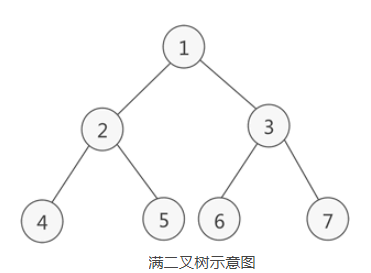
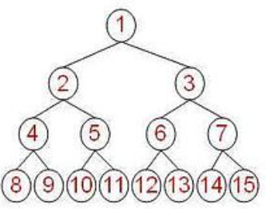
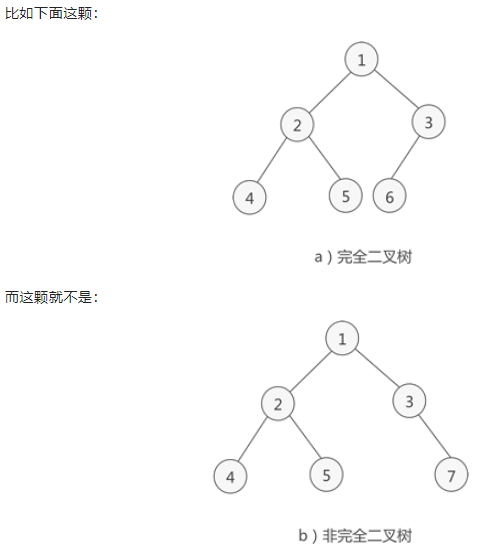
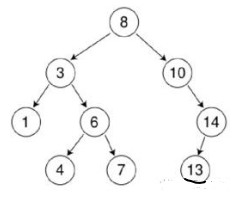
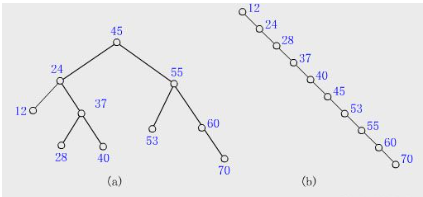
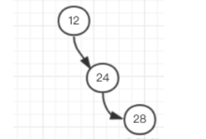
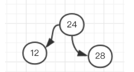
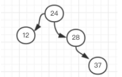
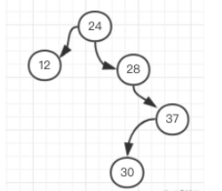
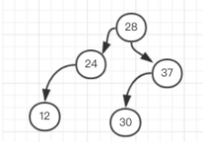

#### 满二叉树
- 如果二叉树中除了叶子结点，每个结点的度都为 2，则此二叉树称为满二叉树（二叉树的度代表某个结点的孩子或者说直接后继的个数）
- 
#### 完全二叉树
1. 完全二叉树是一种特殊的二叉树，满足以下要求：
	- 所有叶子节点都出现在k或者k-1层，而且从1到k-1层必须达到最大节点数（二叉树中除去最后一层节点为满二叉树，且最后一层的结点依次从左到右分布）；
	- 第k层可以不是满的，但是第k层的所有节点必须集中在最左边。
1. 完全二叉树不要求所有树都有左右子树，但需要满足如下：
	- 任何一个节点不能只有右子树没有左子树
	- 叶子节点出现在最后一层或者倒数第二层，不能再往上
	- 
	- 
	- 
1. 当我们用数组实现一个完全二叉树时，叶子节点可以按从上到下、从左到右的顺序依次添加到数组中，然后知道一个节点的位置，就可以轻松地算出它的父节点、孩子节点的位置。
1. 以上面图中完全二叉树为例，标号为 2 的节点，它在数组中的位置也是 2，它的父节点就是 (k/2 = 1)，它的孩子节点分别是 (2k=4) 和 (2k+1=5)，别的节点也是类似。
1. 完全二叉树使用场景：
	- 根据前面的学习，我们了解到完全二叉树的特点是：“叶子节点的位置比较规律”。因此在对数据进行排序或者查找时可以用到它，比如堆排序就使用了它。

#### 二叉查找树（二叉排序树）
- 二叉树的提出其实主要就是为了提高查找效率，比如我们常用的 HashMap 在处理哈希冲突严重时，拉链过长导致查找效率降低，就引入了红黑树。
- 我们知道，二分查找可以缩短查找的时间，但是它要求 查找的数据必须是有序的。每次查找、操作时都要维护一个有序的数据集，于是有了二叉查找树这个概念。
- 二叉查找树（又叫二叉排序树），它是具有下列性质的二叉树：
	- 若左子树不空，则左子树上所有结点的值均小于它的根结点的值；
	- 若右子树不空，则右子树上所有结点的值均大于或等于它的根结点的值；
	- 左、右子树也分别为二叉排序树。
	- 
- 也就是说，二叉查找树中，左子树都比节点小，右子树都比节点大，递归定义。
- 根据二叉排序树这个特点我们可以知道：二叉排序树的中序遍历一定是从小到大的。
- 比如上图，中序遍历结果是：1 3 4 6 7 8 10 13 14

- 二叉查找树的性能
	- 在最好的情况下，二叉排序树的查找效率比较高，是 O(logn)，其访问性能近似于折半查找；
	- 但最差时候会是 O(n)，比如插入的元素是有序的，生成的二叉排序树就是一个链表，这种情况下，需要遍历全部元素才行（见下图 b）。
	- 
	- 如果我们可以保证二叉排序树不出现上面提到的极端情况（插入的元素是有序的，导致变成一个链表），就可以保证很高的效率了。
	- 但这在插入有序的元素时不太好控制，按二叉排序树的定义，我们无法判断当前的树是否需要调整。
	- 因此就要用到平衡二叉树（AVL 树）了。

#### 平衡二叉树
- 平衡二叉树的提出就是为了保证树不至于太倾斜，尽量保证两边平衡。因此它的定义如下：
	- 平衡二叉树要么是一棵空树
	- 要么保证左右子树的高度之差不大于 1
	- 子树也必须是一颗平衡二叉树
- 也就是说，树的两个左子树的高度差别不会太大。
- 那我们接着看前面的极端情况的二叉排序树，现在用它来构造一棵平衡二叉树。
- 以 12 为根节点，当添加 24 为它的右子树后，根节点的左右子树高度差为 1，这时还算平衡，这时再添加一个元素 28：
- 
- 这时根节点 12 觉得不平衡了，我左孩子一个都没有，右边都有俩了，超过了之前说的最大为 1，不行，给我调整！
- 于是我们就需要调整当前的树结构，让它进行旋转。
- 因为最后一个节点加到了右子树的右子树，就要想办法给右子树的左子树加点料，因此需要逆时针旋转，将 24 变成根节点，12 右旋成 24 的左子树，就变成了这样：
- 
- 这时又恢复了平衡，再添加 37 到 28 的右子树，还算平衡：
- 
- 这时如果再添加一个 30，它就需要在 37 的左子树：
- 
- 这时我们可以看到这个树又不平衡了，以 24 为根节点的树，明显右边太重，左边太稀，想要保持平衡就 24 得让位给 28，然后变成这样：
- 
- 依次类推，平衡二叉树在添加和删除时需要进行旋转保持整个树的平衡，内部做了这么复杂的工作后，我们在使用它时，插入、查找的时间复杂度都是 O(logn)，性能已经相当好了。

