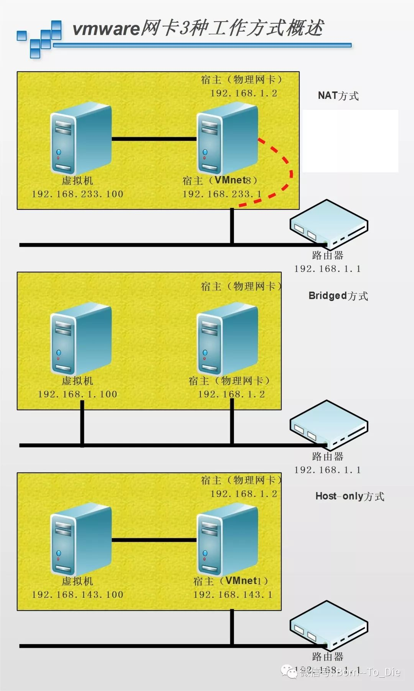
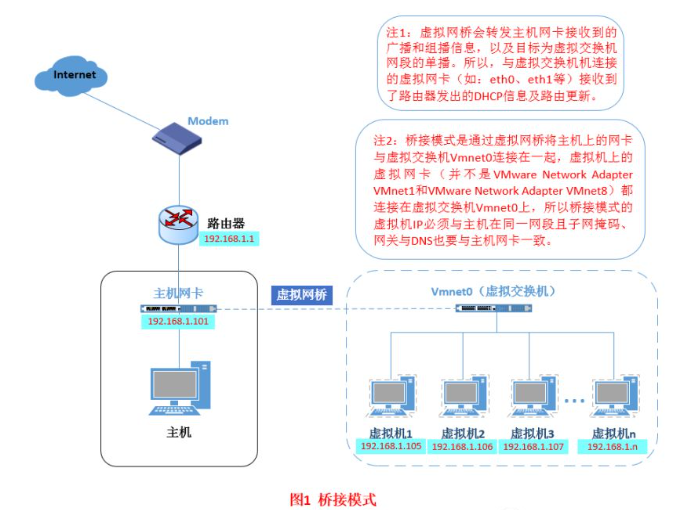
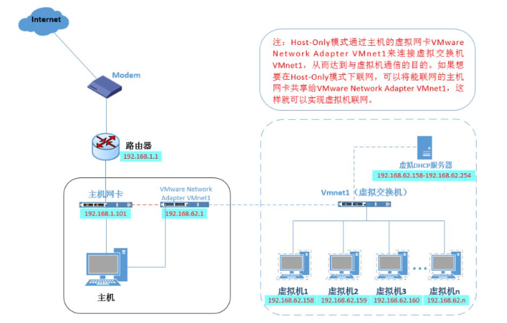
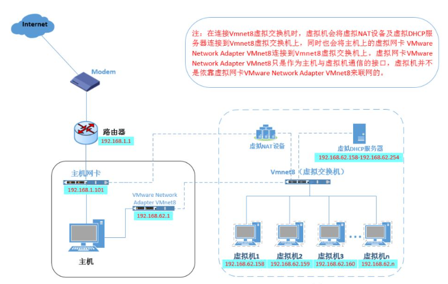

# 虚拟机网络连接介绍
- 虚拟机为我们提供了3种网络工作模式，这3种主要的网络设置方式分别对应不同的网络适配器（网卡）
- 
- 在主机上对应的有VMware Network Adapter VMnet1和VMware Network Adapter VMnet8两块虚拟网卡，它们分别作用于仅主机模式与NAT模式下。
- 在“网络连接”中我们可以看到这两块虚拟网卡，如果将这两块卸载了，可以在vmware的“编辑”下的“虚拟网络编辑器”中点击“还原默认设置”，可重新将虚拟网卡还原。
#### VMnet0（桥接模式网络）
- 指虚拟出的计算机与本系统的计算机所对应的网卡是具有相同功能的
- 桥接模式就是将主机网卡与虚拟机虚拟的网卡利用虚拟网桥进行通信。在桥接的作用下，类似于把物理主机虚拟为一个交换机，所有桥接设置的虚拟机连接到这个交换机的一个接口上，物理主机也同样插在这个交换机当中，所以所有桥接下的网卡与网卡都是交换模式的，相互可以访问而不干扰。
- 在桥接模式下，虚拟机ip地址需要与主机在同一个网段，如果需要联网，则网关与DNS需要与主机网卡一致
- 
#### VMnet1（主机模式网络）
- Host-Only模式其实就是NAT模式去除了虚拟NAT设备，然后使用VMware Network Adapter VMnet1虚拟网卡连接VMnet1虚拟交换机来与虚拟机通信的，Host-Only模式将虚拟机与外网隔开，使得虚拟机成为一个独立的系统，只与主机相互通讯
- 

#### VMnet8（NAT模式网络）
- NAT：网络地址转换
- 如果你的网络ip资源紧缺，但是你又希望你的虚拟机能够联网，这时候NAT模式是最好的选择。NAT模式借助虚拟NAT设备和虚拟DHCP服务器，使得虚拟机可以联网
- 在NAT模式中，主机网卡直接与虚拟NAT设备相连，然后虚拟NAT设备与虚拟DHCP服务器一起连接在虚拟交换机VMnet8上，这样就实现了虚拟机联网。那么我们会觉得很奇怪，为什么需要虚拟网卡VMware Network Adapter VMnet8呢？原来我们的VMware Network Adapter VMnet8虚拟网卡主要是为了实现主机与虚拟机之间的通信
- 
