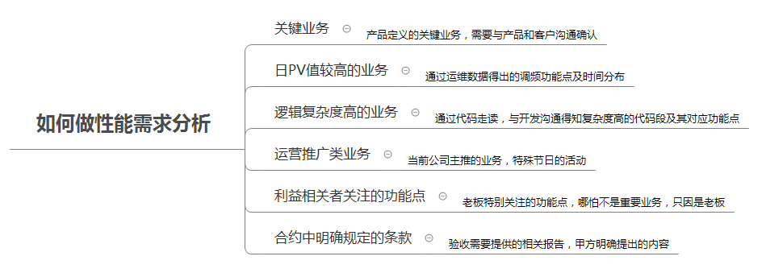
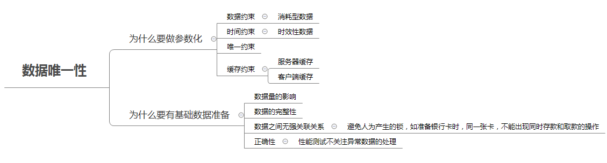

构建性能测试知识体系
==================

#### 理解名词背后的原理
- 在性能测试领域，有很多名词（缩略词），像TPS、响应时间、并发数、线程数等等。不同人眼中对于这些名词的定义并不一样。比如开发看中的可能是线程数（服务端），产品希望得到的是并发数（用户侧），但这二者并不是等同的。还有，TPS和QPS虽然在某些场景下是等同的，但更多时候又不是等同的，因为现在的事务更加复杂，一个T（事务）往往需要多次的Q（查询）来完成。（参考：TPS、并发数与线程数，傻傻分不清楚？）
- 所以，团队成员在沟通对话在时，需要先拉同对齐对这些概念，确保大家说的是同一个问题，避免陷入无休止的争论，但其实说得都不是同一件事。

#### 理解压力是怎么生成的
- 这是做性能测试的第一步，也是最重要的一步。如果我们不能很好的梳理被测系统的生产压力来自哪些功能，那么就会出现用登录场景来评估系统性能的尴尬局面了。在这个知识领域，我们需要弄清楚三个模型：业务模型、数据模型及流量模型。
1. 业务模型
	- 决定了我们要测试哪些场景。因为被测系统的功能那么多，不可能所有的功能点都需要做性能测试（虽然理论上是都要测试，但是成本太高，并不现实），那么如何选择就是个难点。如何做选择呢，笔者简单列了个导图，具体的就不展开了。
	- 
1. 数据模型
	- 在性能测试开始前，我们需要做哪些铺底数据？做多少？这个是需要我们提前规划好的。因为不管是哪类数据库，对于不同体量的数据，所走的查询器选择都是不一样的。几百行的数据走全表扫描肯定比走索引要好，但如果是几百万行呢？这方便需要我们具体地做评估。还要注意的是，为什么我们需要做参数化呢？参数哪些数据？这也是数据模型中要考虑的事。同样的，列个导图，仅供参考
	- 
1. 流量模型
	- 主要指的是每个功能点或者子系统的流量转化率，需要结合我们的业务模型来共同管理，例如，对于秒杀或者整点活动类的场景，流量模型就要特别关注并发的线程数，需要结合用户量来做参考。而对于流程比较长的业务，每个节点都会有流量流失（并不是所有的场景，用户都会从头走到尾），那么这个百分比如何控制，需要结合历史数据，和产品共同来制定。这个强依赖场景，所以就不列导图了。
- 有了这三个模型之后，剩下的就是性能测试脚本的编写和测试执行了。当下很多学性能测试同伴，把更多的精力投入到性能测试工具的学习中，虽然不能说不对，但这仅仅是性能测试的一部分，而且还需要根据实际情况针对性地做选型（虽然Jmeter能解决大部分的问题），代码能力，是做性能测试必备的条件哟。

#### 被测系统是如何搭建的
- 当我们对某个系统做性能测试时，一定要对这个系统架构要有整体的认知，知道被测系统是如何运转起来的，你在做压测和监控时，才能游刃有余。最常见的两种表达系统架构的图是技术架构图和物理拓扑图。
- 技术架构图：这个是希望所有测试人员都要能够画出来的，不论你是做业务测试还是测试开发。当只有你能完整地图出你所测试系统的技术架构时，你才能知道系统到底用到了哪些技术组件，这些组件是如何通信的。只有这样，你才能更有针对性地设计你的测试用例和场景，覆盖到一些组件常见的性能问题。如果你能自己画出自己测试系统的技术架构来，才能说明你对这个系统真的熟悉。
- 物理拓扑图：这个一般是运维同学关注的，现在多数的CMDB系统都可以直接拉出对应的图形，这个有助于在性能测试的过程中更好的设置监控项，以便于更好的发现资源性能问题。

#### 应用如何监控
- 在做性能测试时，我们不能只关注业务层的数据（TPS、响应时间、正确率、稳定性等），还需要我们关注一些技术指标（JVM、线程数、缓存、连接数及各类中间件的配置指标）及系统资源（CPU、内存、IO）。这些指标不能只靠人眼去观察，需要有一整套的监控体系来协助你。
- 业内常见的Zabbix、Glances、Prometheus+Grafana 等都是可视化监控常用的手段，对于代码层的链路追踪，常用的有SkyWalking、PinPoint等等。当然，这些监控工具都离不开最基础的命令监控，类似于TOP、IOSTAT、JSTACK等命令，能够快速帮助我们定位和发现问题。建议大家熟练使用一些常用命令，因为有时候生产环境并不会让你安装那么多监控工具。
- 现在，更多的服务部署在云上，或者容器中，给监控带来了更多的挑战，这些新技术的出现，希望我们也要与时俱进，掌握监控它们的方案。

#### 如何定位及排错
1. 了解计算机的基本原理
	- 比如CPU是如何工作的，为什么需要内存，什么情况下说明内存是不够用了（需要了解Linux与Windows对于内存管理的机制异同点）？为什么会流行一句话“一切性能问题皆IO”？只有当我们了计算机的基本原理后，我们才能有方向。
1. 理解技术实现的原理
	- 比如在数据库层，为什么索引会更高效？它的弊端又是什么？为什么研发要引入Redis，它的好处是什么？如何理解Redis的透传与雪蹦现象，等等类似的问题，我们需要理解很多中间件的实现细节。这些你不一定需要自己全懂，但至少要有个映像，能够和开发进行更多的沟通，而不仅仅是报一些监控数据。
1. 验证你的猜想
	- 这一点其实非常的重要。在性能测试的过程中，我们遇到的问题往往是综合因素共同作用产生的，这就需要我们要有一定的猜想能力，依据自己或者团队的验证，猜想可能是什么问题，但不能仅停留在猜想上，需要我们有验证的能力，否则就是瞎猜，不足为凭。（参考数据什么会走丢了呢？）

#### 性能测试实践
- “纸上学终觉浅，绝知此事要躬行”，道理懂得再多，也需要有实践的机会。性能测试是非常考验测试人员的个人经验。需要在不断的实践中成长。很多人可能会抱怨没有实践的机会，因为公司并没有提供相应的机会。个人的观点是，你日常的被测系统，其实就是最好的联系对象，尝试去理解那些技术组件，自己动手搭建一套玩玩。在夜深人静的时候，写写脚本去压一压，和运维搞好关系，要点监控的权限，都是可行的方案。因为，当初的我，就这么练习过来的。只有你做出成绩了，团队才会重视，才有可能给出对应的资源，让你去成长。
