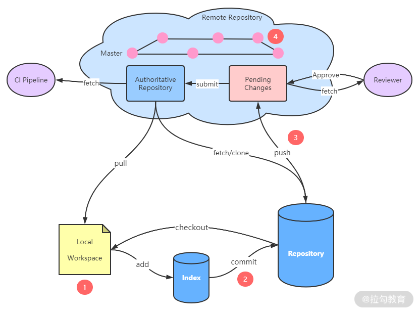

代码预检查
=========
#### 什么是代码预检查
- 代码预检查就是在代码提交到代码库之前对代码进行检查，包括静态检查、Code Review、测试、编译等多种方式。主要目的就是保证提交到代码库的代码的质量。
- 强调提交到代码库的代码的质量的原因：
	- 版本控制系统除了可以维护软件每次修改的完整历史，还有一个非常重要的用途，让团队一起开发软件的不同部分，它是团队高效协作的工具。
	- 一旦低质量的代码提交到代码库，那么就会更新到团队每个成员的本地仓库，低质量的代码不仅会导致后续维护困难，也为软件的健壮性埋下了祸根。 
	- 因此，将低质量代码直接拦在门外，然后通过代码检查等方式指导开发人员哪里有问题，如何修改，开发人员按照提示进行修改，直到满足要求。
- 目前版本控制系统都是采用分布式版本控制系统，如 Git。根据 Git 的架构设计，可以在下图中 ①②③④ 进行代码预检查。如下图所示，下半部分是指开发人员本地仓库，上半部分是指远程仓库。这几个检查点是：
	- 
	- ①本地检查， 一般是在开发人员本地开发空间进行检查，比如 IDE 的插件检查，本地编译时检查；
	- ②本地提交， 一般当代码提交到本地仓库时进行检查，可以使用 Git 的客户端 Hook，如 pre-commit、pre-merge 进行检查；
	- ③远程提交， 一般当代码提交到远程仓库时进行检查，这时会先提交到临时分支，当评审人同意后再合入代码库，比如 Gerrit；
	- ④分支合并， 一般当代码从一个分支合并到另一个分支时进行检查，评审人进行 Code Review，同意之后再合入另一个分支，常见的分支合并方式有 MR（Merge Request）和 PR（Pull Request）两种。
	- 这几个检查点的使用场景、成本和收益各不相同。每家企业在落地代码预检查的时候也会根据内部情况各有侧重。
#### 为什么要做代码预检查
- 代码预检查的主要目的就是保证提交到代码库的代码的质量。在当今快速发展的数字经济中，没有一个企业不是通过软件来支撑业务的。软件是业务发展的核心，因此软件的整体质量非常重要。高质量的软件可以带来客户满意度、用户量和收入，而更好的设计可以使组织更轻松的赢得市场。
- 当我们面临稍纵即逝的市场机会而对软件交付充满时间压力的时候，可以临时适当降低对软件质量的标准。但是，从长远考虑，我们绝对要重视软件质量。软件是由代码编写而成的，代码的质量是软件质量的决定性因素，因此，重视软件质量，其中的核心就是要重视代码的质量。总结一下，代码的质量的重要性主要有三个原因。
    - 可读性：代码不只是给机器理解的，也是给人看的。要能够使团队中的每个人都能容易的阅读和理解代码。
    - 可维护性：当维护和测试高质量的代码时更加容易、安全和省时，且不易出问题。
    - 减低技术债务：高质量的代码设计良好，技术债少，开发人员无须花费大量的时间修复代码的问题和重构，因此，可以加快软件开发的进度。新团队成员容易理解代码，更容易加入项目。
#### 代码预检查实践有哪些
- 虽然代码质量对于现在的软件项目非常重要，但绝不要搞“代码质量月，利用一个月的时间，将代码质量提高到百分之百，消灭所有的 Bug”这样的活动。《丰田套路：转变我们对领导力与管理的认知》一书中介绍过“改善套路”：以循环的方式不断改进。我们也可以利用循环、培养等手段，将提高代码质量的活动融入每个迭代中，形成一种习惯。下面介绍几种能够提高代码质量的预检查的工具和实践。
1. 本地检查
	- 本地检查是指在开发人员本地执行的检查，比如 IDE 或命令行的方式。本地检查有优点也有缺点。
	- 优点：
		- 按照检查前置的原则，本地检查的时机是最合适的，发现问题和修复问题的成本是最低的；
		- 因为是在本地执行，执行检查的效率最快。
	- 缺点：
		- 需要开发人员具有很高的自觉性。

	- 本地检查常用的检查工具和实践有：
		- IDE 插件：SonarLint、FindBugs、CheckStyle、PMD、阿里规范插件等，可以检查代码的编码风格，坏味道，漏洞等
		- 本地构建：maven 编译、gradle 编译，可以检查代码语法问题，是否能够编译过。
		- 本地测试：单元测试，可以检查代码的逻辑问题。
1. 本地提交检查
	- 本地提交检查是指在本地执行git commit的时候进行的检查，这种检查方式同样有优点和缺点。
	- 优点：
		- 检查的时机适中；
		- 检查的效率较高；
		- 基于 Git 的 Hook 机制，在每次提交时运行 Hook，自动识别代码中的简单问题，代码审阅者只专注于代码逻辑和系统结构，避免因为琐碎的样式问题而浪费时间。
	- 缺点：
		- 本地提交对提交速度要求很高，只能进行省时的静态检查，如代码风格等；
		- 客户端的 Hook，因为是在开发人员本地，并未实现完全“强制”检查；
		- 同样依赖开发人员的自觉性。
	- 使用 Git 的 pre-commit 钩子能够在提交时检查代码问题。但随着我们创建的项目越来越多，使用的编程语言也各不相同，在不同的代码库之间共享 pre-commit 的钩子脚本是一件非常痛苦的事情。需要在每个项目之间拷贝脚本，还需要手动更改脚本才能适用于不同的项目结构。
	- 介绍一个 pre-commit 的多语言包管理工具——[pre-commit](https://pre-commit.com/)。在每个代码库中，只需要指定所需要的钩子列表，在每次提交之前，pre-commit 就会安装并执行任何语言的钩子。
	- pre-commit 安装教程可以参考官网。主要配置文件如下，在每个代码库中都维护该配置文件，指定需要钩子的代码库、版本以及钩子的 ID。这样就可以像代码一样管理 pre-commit 的钩子，还可以进行版本控制。
	```
	[root@localhost devops]# cat .pre-commit-config.yaml
	# See https://pre-commit.com for more information
	# See https://pre-commit.com/hooks.html for more hooks
	repos:
	-   repo: https://github.com/pre-commit/pre-commit-hooks
	    rev: v2.4.0
	    hooks:
	    -   id: trailing-whitespace
	    -   id: end-of-file-fixer
	    -   id: check-yaml
	    -   id: check-added-large-files
	```
	- 在每次提交时，会按照配置文件中指定的钩子进行检查，有些钩子还能自动处理代码中的问题，如：去除空格。当钩子的退出码为非 0 时，表示 Failed。具体的执行结果如下：
	```
	[root@localhost devops]# git commit -m "fixed #123 issue"
	Trim Trailing Whitespace.................................................Failed
	- hook id: trailing-whitespace
	- exit code: 1
	- files were modified by this hook
	
	Fixing Hello.java
	
	Fix End of Files...........................................Passed
	Check Yaml.................................................Passed
	Check for added large files................................Passed
	```
1. 远程提交检查
	- 远程提交检查是指在本地执行git push提交到远程仓库时执行的检查，远程提交检查同样有优点和缺点。
	- 优点：
		- 能够进行较为深层次的动态检查，比如漏洞、Bug，检查的效果较好；
		- 能够做到强制检查，保证任何人提交的代码都是高质量的；
		- 代码提交后并未直接提交到代码库中，可以加入人工评审环节，可以检查代码的业务逻辑和架构设计等较复杂问题；
		- 可以控制每次提交的代码质量。
	- 缺点：
		- 检查的时机靠后，反馈周期较长；
		- 需要搭建代码检查服务器；
		- 维护成本较高；
		- 每次提交都检查，会拖慢团队的开发节奏。
	- 常用的检查工具和实践有下面这些。
		- 代码检查
			- 需要搭建代码检查服务器，比如 SonarQube。当代码提交后，自动触发代码检查并根据检查结果决定是否合入代码库。为了避免历史债务对问题修复的影响，可以考虑使用增量检查，只检查本次提交修改的文件，这样就不会因为问题太多打消提交者解决问题的积极性。在之前的实践中，我们每次提交时进行增量检查，控制新增代码的质量。在发版时，对全量代码进行检查，作为系统发版的质量关卡。质量分值每月递增，从而达到持续提升代码质量的目的。
		- 人工评审
			- 是指当代码提交后，由团队中高级别人员对代码进行评审。评审人会检查本次变更是否符合编码规范以及是否采用了最佳的技术解决方案，并在评审页面以行间评论的方式发表评审意见，提交人根据评审意见进行修改，直到满足评审人的要求。目前常用的代码评审工具如 Gerrit，通过与Jenkins 集成可以实现机器检查和人工评审的同时审核，这也是目前企业里用得最多的实践。下图是查看本次变更内容的 Gerrit 评审页面。
		- 自动化测试
			- 上面两个检查具有一定的局限性。代码检查能够发现代码问题，但不能发现功能性问题。人工检查对评审人的要求较高。比较有效的做法是使用 JaCoCo 检测单元测试覆盖率，或者执行一定范围的集成测试。建议选择系统的核心场景、10 分钟以内能够执行完成的测试用例。
1. 分支合并检查
	- 分支合并检查是指在远程仓库里执行分支合并的时候进行的检查，分支合并检查的优点和缺点如下。
	- 优点：
		- 每次在分支合入时进行检查，既能控制合入其他分支的代码质量，又不会对开发节奏造成影响；
		- 分支合并时一般表示一个功能和问题开发完成，可以有相对充足的时间执行较为深层次的动态检查，比如漏洞，Bug 等；
		- 可以设置强制检查，保证合入分支的代码是高质量的；
		- 可以做 Code Review，评审人一次性评审完整的功能代码（不推荐长期分支，大功能开发）;
		- 代码托管平台支持，如 GitHub、GitLab。
	- 缺点：
		- 检查的时机靠后，反馈周期较长。
	- 参用的检查工具和实践：
		- GitHub 的 PR
			- 当进行分支合并时，提交人申请 Pull Request，目标分支通过 Pull 的方式从提交分支上更新代码。在这个 PR 申请中，评审人进行 Code Review，同时触发 GitHub Action 执行自动化构建、测试、代码扫描等。
		- GitLab 的 MR
			- 当进行分支合并时，提交人申请 Merge Request，目标分支通过 Merge 的方式从提交分支上更新代码。在这个 MR 申请中，评审人进行 Code Review，同时触发 GitLab CI/CD pipeline 进行自动化构建，测试，环境部署等。下图是 GitLab 中在 Code Review 时添加的评论。
	